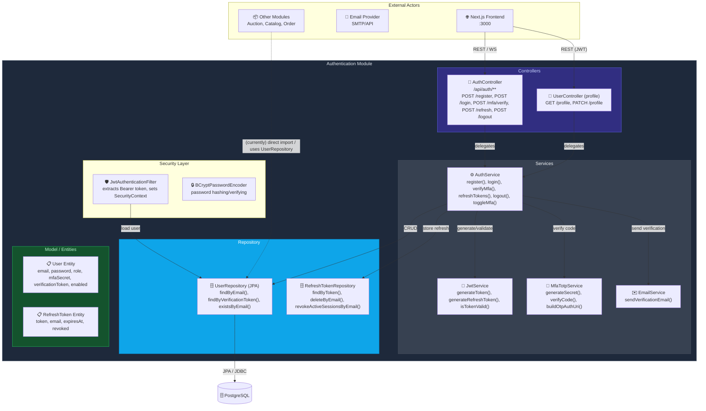
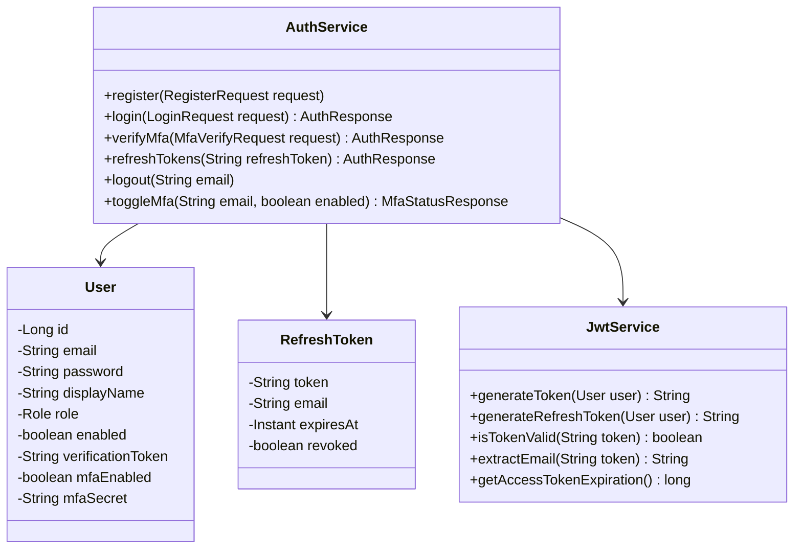
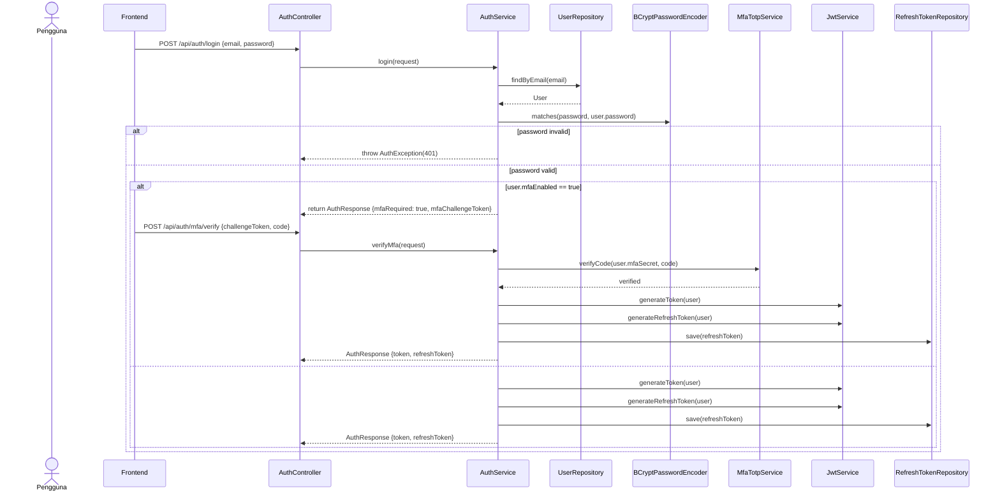
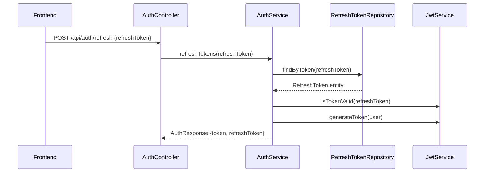

## Authentication Module

Below are diagrams and descriptions for the BidMart authentication module (controllers, services, repositories, DTOs, and security components).

### Component Diagram

### Ringkasan Interaksi (endpoints → internal calls)

| From | To | Interaksi | Protokol |
|---|---|---|---|
| Frontend | `AuthController` | `POST /api/auth/register` → `AuthService.register()` (send verification email) | REST/JSON |
| Frontend | `AuthController` | `POST /api/auth/login` → `AuthService.login()` (may return MFA challenge token) | REST/JSON |
| Frontend | `AuthController` | `POST /api/auth/mfa/verify` → `AuthService.verifyMfa()` (verify TOTP, then issue tokens) | REST/JSON |
| Frontend | `AuthController` | `POST /api/auth/refresh` → `AuthService.refreshTokens()` (validate persisted refresh token) | REST/JSON |
| Frontend | `AuthController` | `POST /api/auth/logout` → `AuthService.logout()` (delete refresh tokens) | REST/JSON |
| Admin Frontend | `AuthController` | `GET /api/auth/users` → `AuthService.getAdminUsers()` (includes active session counts via `RefreshTokenRepository`) | REST/JSON |
| Admin Frontend | `AuthController` | `POST /api/auth/admin/users/{id}/sessions/revoke` → `AuthService.revokeUserSessions()` | REST/JSON |
| Any Service | `JwtAuthenticationFilter` | Extract Bearer token → `JwtService.isTokenValid()` and `UserRepository.findByEmail()` | Servlet Filter |

### Class Diagram — core types

### Sequence Diagram — Login + MFA flow

### Sequence Diagram — Refresh tokens

### Notes & Migration guidance

- The current monolith stores `User` and `RefreshToken` in the same DB; when extracting Auth as a service, keep refresh tokens private to Auth's datastore.
- Replace direct repository imports from other modules with published events (e.g. `user.banned`) or a service API to avoid tight coupling.
- Continue to use short-lived JWTs for clients and persist refresh tokens server-side for session control.

---
