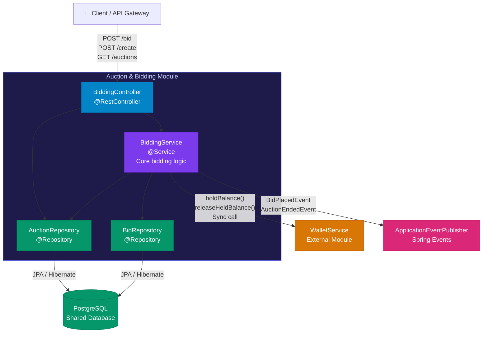
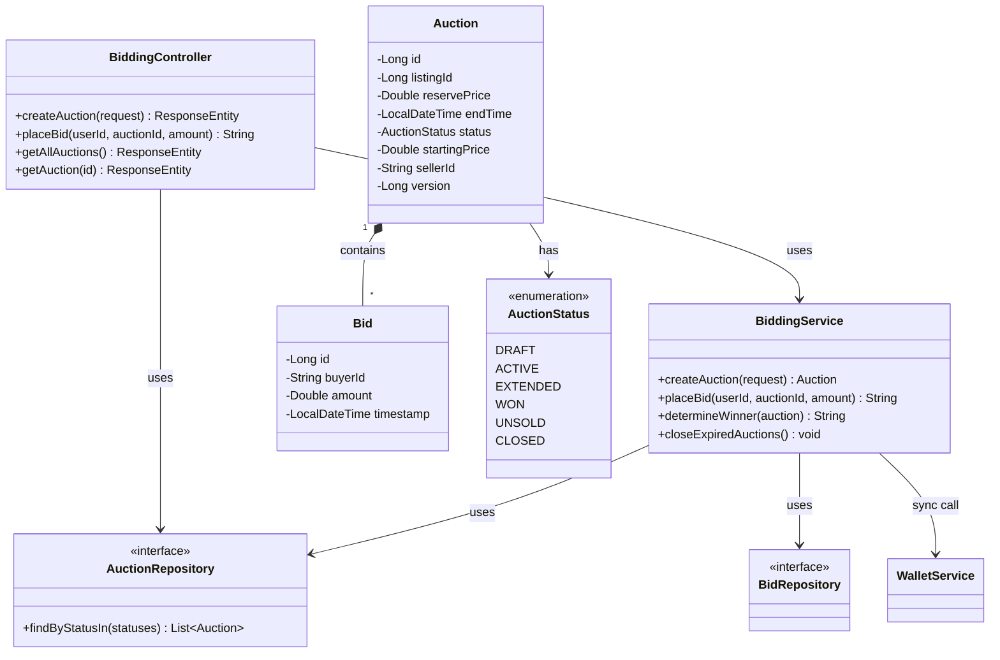

## Individual Work - Tsaniya Fini Ardiyanti

### Component Diagram - Auction & Bidding Module

Diagram ini menunjukkan struktur internal Bidding Module, bagaimana 
request bid masuk melalui Controller, diproses BiddingService yang 
menangani concurrency dan anti-sniping, lalu berinteraksi dengan 
WalletService secara sinkronus untuk hold dana dan mempublish event 
ke modul lain secara asinkronus.

### Code Diagram - Auction & Bidding Module

Class diagram dipetakan langsung dari source code, mencakup relasi 
antar entity dan dependency ke WalletService.

### Korelasi Diagram

Component Diagram menunjukkan alur request dari Client masuk ke 
BiddingController, diproses BiddingService yang menangani validasi bid 
dan optimistic locking untuk mencegah race condition saat bidding war. 
Class Diagram memperbesar bagian data model `Auction` sebagai aggregate 
root yang menyimpan daftar `Bid`, dengan `AuctionStatus` yang merepresentasikan 
state machine lifecycle lelang dari DRAFT hingga WON atau UNSOLD.

Poin kritis ada di BiddingService yang memanggil WalletService secara 
sinkronus untuk hold dana, inilah yang menjadi bottleneck R2 di Risk 
Storming dan akan digantikan dengan event `bid.placed` di arsitektur 
masa depan.