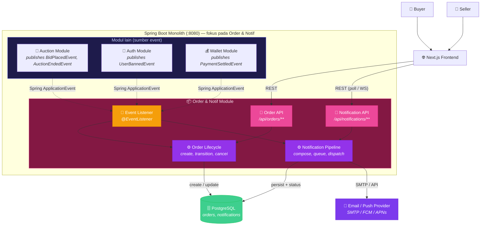
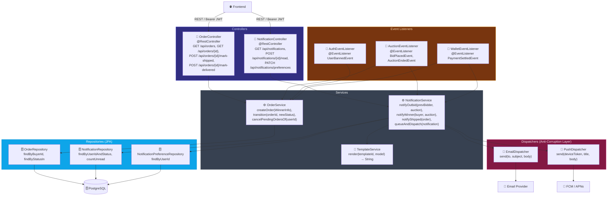
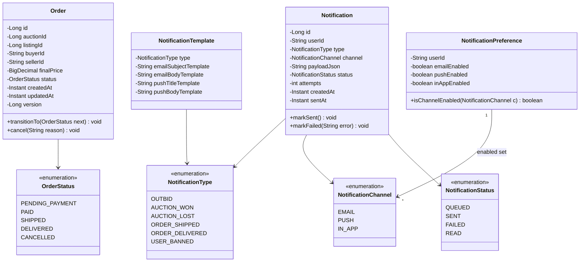
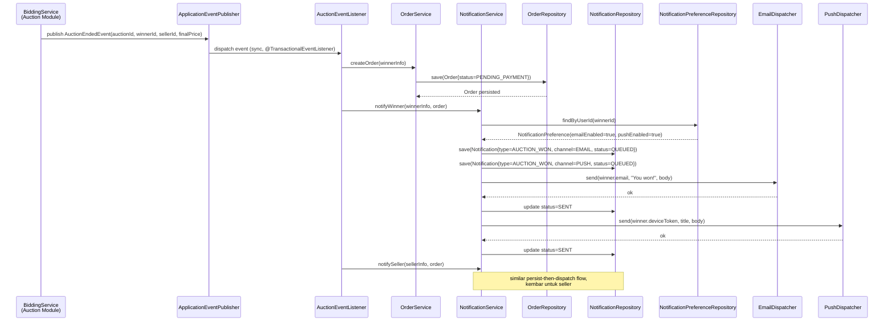
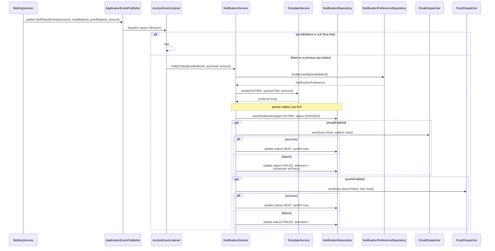

## Individual Work — Fidel Akilah

### Order & Notification Module

Modul ini bertanggung jawab atas dua tanggung jawab terkait di BidMart:

1. **Order lifecycle** — saat sebuah lelang berakhir dan pemenangnya ditentukan,
   modul ini membuat record `Order` yang menautkan buyer, seller, listing, dan
   harga final, lalu memajukan order tersebut melalui status `PENDING_PAYMENT
   → PAID → SHIPPED → DELIVERED` (atau `CANCELLED`).
2. **Notifications** — modul ini juga mengirim notifikasi email / push kepada
   user untuk peristiwa penting (outbid, lelang dimenangkan, order dikirim,
   user di-banned, dll.) melalui satu Email/Push Provider eksternal.

Di arsitektur saat ini kedua tanggung jawab tersebut hidup di dalam satu Spring
Boot module dengan database PostgreSQL bersama, dan menerima event dari modul
Auction melalui Spring `ApplicationEventPublisher`. Di arsitektur masa depan
modul ini menjadi `Order & Notif Service` independen yang berlangganan ke
event `auction.winner_determined`, `bid.placed`, dan `user.banned` melalui
message broker.

---

### Container Diagram — Order & Notification (zoom dari Container Diagram grup)

Diagram ini memperbesar bagian "📦 Order & Notif Module" dari Container Diagram
keseluruhan grup. Inbound: REST dari Frontend (lihat history order, baca
notifikasi), event internal dari Auction Module, dan event dari Auth Module
ketika ada user di-banned. Outbound: tabel `orders` + `notifications` di
PostgreSQL bersama, dan API Email/Push Provider untuk pengiriman aktual.

| From | To | Interaksi | Protokol |
| --- | --- | --- | --- |
| Frontend (Buyer/Seller) | `OrderController` | Lihat history order, detail order, tandai diterima | REST/JSON |
| Frontend | `NotificationController` | List unread notif, mark as read, kelola preferensi | REST/JSON |
| Auction Module | `AuctionEventListener` | `BidPlacedEvent`, `AuctionEndedEvent` (Spring event) | In-process |
| Auth Module | `AuctionEventListener` | `UserBannedEvent` — batalkan order pending milik user | In-process |
| Wallet Module | `AuctionEventListener` | `PaymentSettledEvent` — pindah order ke `PAID` | In-process |
| `NotificationDispatcher` | Email/Push Provider | Kirim email verifikasi, outbid, won, order shipped | SMTP / HTTPS |

---

### Code Diagram 1 — Component Diagram (Controllers, Services, Repositories)

Component diagram memperlihatkan struktur internal modul: controller membuka
endpoint REST, service membungkus logika bisnis, dispatcher mengisolasi
panggilan ke provider eksternal, dan event listener menjembatani modul ini
dengan modul lain di monolith.

Pemisahan `EmailDispatcher` dan `PushDispatcher` sebagai komponen tersendiri
penting untuk menjaga `NotificationService` tetap testable: di unit-test
keduanya dapat diganti dengan mock tanpa pernah memanggil provider asli.
Ketika nanti modul ini dipindah ke service tersendiri, dispatcher inilah
yang berubah implementasi (misal jadi adapter Kafka/Outbox pattern) tanpa
menyentuh logika bisnis di service.

---

### Code Diagram 2 — Class Diagram (Domain Model)

Class diagram menggambarkan entitas inti modul: `Order` sebagai aggregate root
yang punya state machine status, dan `Notification` sebagai event log yang
dipasangkan dengan `NotificationPreference` per user untuk menentukan channel
apa saja yang aktif.

Catatan desain:

- `Order.version` (optimistic locking) penting agar transisi status concurrent
  dari Wallet event dan dari admin tidak saling menimpa.
- `Notification.payloadJson` sengaja disimpan sebagai snapshot (denormalisasi)
  supaya isi email tidak berubah walau data sumber (mis. listing dihapus)
  sudah berubah. Ini juga memudahkan re-send saat dispatcher gagal sementara.
- `NotificationTemplate` membuat copy-writing dapat di-update tanpa redeploy.

---

### Code Diagram 3 — Sequence Diagram (Auction Winner → Create Order → Notify)

Sequence diagram ini menelusuri alur paling kritis: ketika `BiddingService`
menentukan pemenang sebuah lelang, modul ini harus membuat `Order` baru dan
mengirim notifikasi "menang" ke buyer serta notifikasi "terjual" ke seller,
dalam satu transaksi yang aman dari double-emit.

Poin penting:

- Listener menggunakan `@TransactionalEventListener(phase = AFTER_COMMIT)` agar
  notifikasi hanya dikirim setelah transaksi `Order` ter-commit; ini mencegah
  notifikasi "menang" terkirim ketika order gagal disimpan karena rollback.
- Notification ditulis ke DB **sebelum** dispatcher dipanggil (Outbox-style)
  supaya jika provider down sementara, kita masih bisa re-dispatch lewat
  scheduler tanpa kehilangan kejadiannya.

---

### Code Diagram 4 — Sequence Diagram (BidPlaced → Outbid Notification)

Diagram terakhir menelusuri jalur yang paling sering jalan: setiap kali ada
bid baru, peserta sebelumnya (bidder tertinggi yang lama) harus diberi tahu
bahwa dirinya ter-outbid. Ini high-volume dan tidak boleh menahan critical
path bidding.

Catatan desain:

- Listener untuk `BidPlacedEvent` dipasangi `@Async` (di-execute oleh thread
  pool terpisah) agar pemanggilan `EmailDispatcher` yang lambat **tidak**
  memperlambat respons HTTP dari `BiddingController` ke pembidder.
- Karena retry dilakukan oleh scheduler yang membaca `Notification` dengan
  `status=FAILED && attempts<MAX`, kegagalan provider tidak menyebabkan
  notifikasi hilang. Inilah cikal-bakal pola **Transactional Outbox** yang
  nanti akan saya pakai saat modul ini dipindah ke message broker di
  arsitektur masa depan.
- Saat migrasi ke arsitektur microservices, `AuctionEventListener` cukup
  diganti menjadi consumer `bid.placed` dari RabbitMQ/Kafka — sisa logika
  (template, persistence, retry) tetap sama. Inilah yang membuat pemisahan
  antara *Event Listener* dan *Notification Pipeline* pada Component Diagram
  bernilai: ia membuat migrasi nantinya bersifat lokal, bukan rewrite.

---

### Korelasi antar diagram

- **Container Diagram** menempatkan modul ini dalam konteks monolith yang ada,
  menunjukkan boundary I/O-nya (Frontend di sisi inbound; database + email/push
  provider di sisi outbound; event Spring dari Auction/Auth/Wallet di sisi
  internal).
- **Component Diagram** memperbesar boundary tersebut menjadi tiga lapisan
  (Controllers → Services → Repositories) plus dua kotak khusus
  (`Dispatchers` dan `Event Listeners`) yang menjadi titik sambung ke dunia
  luar maupun ke modul lain dalam monolith.
- **Class Diagram** menjelaskan model domain di balik service tersebut —
  `Order` sebagai aggregate dengan state machine, dan `Notification` plus
  `NotificationPreference`/`NotificationTemplate` sebagai pola Outbox + per-user
  preference.
- Dua **Sequence Diagram** mendemonstrasikan dua alur paling penting:
  `AuctionEndedEvent` (low-volume, harus reliable) dan `BidPlacedEvent`
  (high-volume, harus cepat). Strategi yang dipakai berbeda
  (`@TransactionalEventListener(AFTER_COMMIT)` synchronous vs `@Async`), dan
  perbedaan itu langsung tercermin di Component Diagram pada arah panah
  antara `AuctionEventListener` dan `NotificationService`.

Saat arsitektur masa depan dijalankan, perubahan utamanya hanyalah mengganti
`ApplicationEventPublisher` + `@EventListener` dengan RabbitMQ/Kafka producer
dan consumer. Struktur internal (Service → Repository → Dispatcher) tidak
berubah, hingga modul ini benar-benar siap dipindah ke service-nya sendiri
tanpa rewrite.
