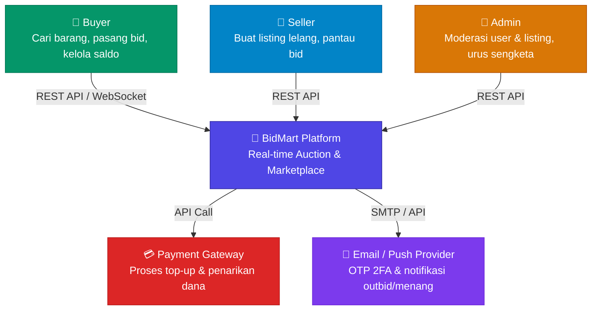
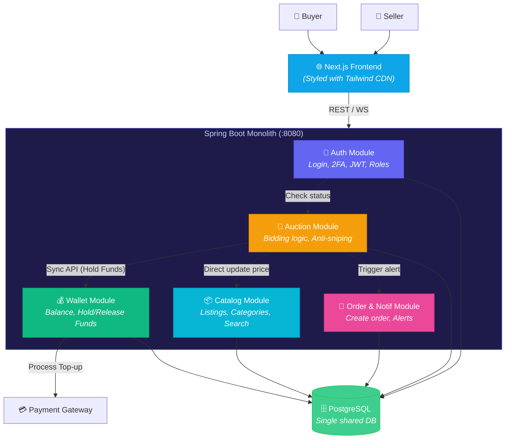
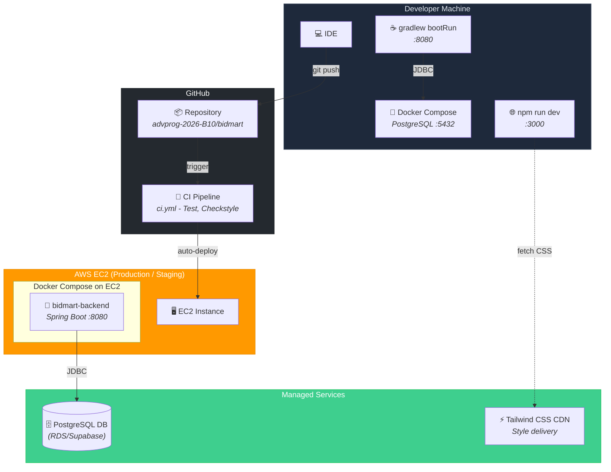
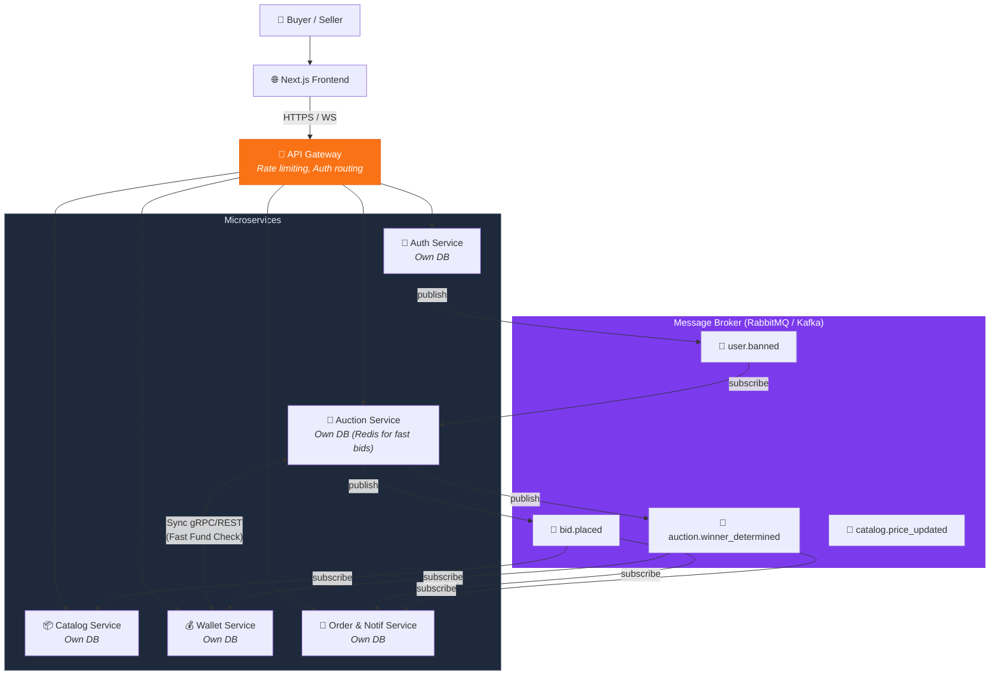

# BidMart — Kelompok B10

> Platform lelang kompetitif real-time yang mempertemukan pembeli dan penjual
> dalam sesi bidding yang terstruktur, aman, dan responsif.

---

## Individual Work

- [Ahmad Wasis Shofiyulloh - Auth Module](Auth.md)
- [Fidel Akilah](#)
- [Josiah Naphta Simorangkir](#)
- [Petrus Wermasaubun](Wallet.md)
- [Tsaniya Fini Ardiyanti - Bidding Module](Bidding.md)

---

## Arsitektur Saat Ini

### System Context (C4 Level 1)

BidMart melayani tiga jenis pengguna: Buyer yang aktif mencari barang dan
memasang bid, Seller yang membuka sesi lelang, dan Admin yang menjaga kesehatan
platform. Untuk memproses transaksi keuangan dan pengiriman notifikasi, BidMart
bergantung pada dua sistem eksternal, Payment Gateway dan Email/Push Provider.

| Actor | Role | Description |
| --- | --- | --- |
| Buyer | Person | Menelusuri katalog, melakukan bidding, mengelola saldo |
| Seller | Person | Membuat listing lelang (harga awal, reserve price, durasi) |
| Admin | Person | Mengawasi platform, banned user, atur permission dinamis |
| BidMart Platform | Software System | Platform lelang real-time yang sedang dibangun |
| Payment Gateway | External System | Proses keluar-masuk uang ke dompet digital |
| Email/Push Provider | External System | Kirim kode 2FA dan notifikasi outbid/menang |

---

### Container Diagram (C4 Level 2)

Seluruh logika bisnis saat ini hidup dalam satu Spring Boot monolith yang
berjalan di port 8080. Frontend Next.js berkomunikasi dengan backend melalui
REST dan WebSocket. Di dalam monolith, lima modul berkomunikasi secara
sinkronus dan berbagi satu database PostgreSQL.

Ketergantungan sinkronus antar modul menjadi perhatian utama. Auction Module
harus menunggu respons dari Wallet Module sebelum bid dapat dikonfirmasi,
artinya kelambatan di Wallet langsung berdampak pada pengalaman bidding.

| From | To | Jenis Coupling | Alasan |
| --- | --- | --- | --- |
| Auction → Wallet | Sinkronus | Wajib hold dana seketika sebelum bid diterima |
| Auction → Catalog | Sinkronus | Update harga tertinggi di katalog saat bid masuk |
| Auction → Order/Notif | Sinkronus | Langsung kirim notifikasi outbid/menang |
| Auth → Auction | Sync/Event | Kalau admin banned user, bid aktifnya harus langsung di-handle |

---

### Deployment Diagram

Backend di-deploy sebagai Docker container di EC2, terhubung ke PostgreSQL
terkelola. Frontend Next.js di-deploy secara independen. GitHub Actions
menangani CI/CD, setiap push ke main branch memicu testing otomatis
sebelum deployment.

| Layer | Tech Stack | Detail |
| --- | --- | --- |
| Backend Runtime | Spring Boot (Java) | Di-build via Gradle, running di Docker |
| Frontend | Next.js | Tailwind CSS via CDN |
| CI/CD | GitHub Actions | Testing otomatis via ci.yml |
| Database | PostgreSQL | Single instance untuk semua modul |

---

## Arsitektur Masa Depan

Setelah migrasi, BidMart bertransisi ke arsitektur microservices berbasis
Event-Driven Architecture (EDA). Setiap modul menjadi service independen
dengan database-nya sendiri. Komunikasi antar service dilakukan secara
asinkronus melalui message broker (RabbitMQ/Kafka). API Gateway menangani
routing, autentikasi, dan rate limiting di lapisan terdepan.

### Key Events

| Event | Publisher | Subscribers | Tujuan |
| --- | --- | --- | --- |
| `bid.placed` | Auction Service | Catalog, Order/Notif | Update harga katalog async & notif outbid |
| `auction.winner_determined` | Auction Service | Wallet, Order/Notif | Konversi hold dana jadi payment, buat order |
| `user.banned` | Auth Service | Auction | Gugurkan bid aktif & lepas dana tertahan |

---

## Risk Storming

Sesi Risk Storming dilakukan dengan skenario: BidMart sedang mengadakan
lelang barang populer yang diikuti ribuan user secara bersamaan.

### Peta Risiko

| Risk | Risiko | Dampak | Likelihood | Score | Area |
| --- | --- | --- | --- | --- | --- |
| R1 | Database locking saat bidding war | High (3) | High (3) | 🔴 9 | Performance |
| R2 | Wallet sync bottleneck memblokir bid | High (3) | High (3) | 🔴 9 | Availability |
| R3 | Single point of failure (monolith crash) | High (3) | Medium (2) | 🔴 6 | Availability |
| R4 | Anti-sniping thread exhaustion | Medium (2) | Medium (2) | 🟡 4 | Performance |
| R5 | Catalog read terganggu tulis auction | Medium (2) | Medium (2) | 🟡 4 | Performance |

R1 dan R2 adalah risiko paling kritis. Ratusan bid yang masuk dalam hitungan
detik akan menyebabkan ratusan transaksi berebut mengunci baris yang sama di
database. Di saat yang sama, setiap bid harus menunggu Wallet Module selesai
mem-hold dana secara sinkronus, bottleneck di satu titik ini memperlambat
seluruh proses lelang.

R3 menjadi risiko eksistensial karena kegagalan di Auction Module akibat
lonjakan traffic bisa menyebabkan OOM yang mematikan seluruh aplikasi,
termasuk halaman login dan halaman katalog yang sama sekali tidak berkaitan.

### Justifikasi Modifikasi Arsitektur

Pemisahan setiap modul menjadi service independen dengan database-nya sendiri
secara langsung memutus rantai kegagalan yang teridentifikasi. Ketika Auction
Service membutuhkan lebih banyak kapasitas saat bidding war, ia bisa di-scale-out
secara independen tanpa membebani Auth atau Catalog Service. Database yang
terpisah berarti query berat di Auction tidak lagi bisa menghambat pembacaan
katalog (menjawab R1, R3, dan R5 sekaligus).

Penggantian pemanggilan sinkronus dengan event asinkronus melalui message
broker menjadi kunci untuk mengatasi R2 dan R4. Dalam arsitektur baru, Auction
Service hanya perlu melakukan satu pengecekan saldo cepat via gRPC ke Wallet
Service, kemudian langsung mengembalikan respons sukses ke user. Pembaruan
harga di Catalog dan pengiriman notifikasi outbid terjadi di background melalui
event `bid.placed`, response time bidding menjadi jauh lebih cepat dan tidak
terpengaruh oleh beban di service lain.

Message broker juga berperan sebagai buffer saat lonjakan traffic terjadi.
Event yang belum sempat diproses akan mengantri di broker dan dikonsumsi
secara bertahap sesuai kapasitas masing-masing consumer, bukan langsung
membebani database seperti yang terjadi di arsitektur monolitik saat ini.

---
